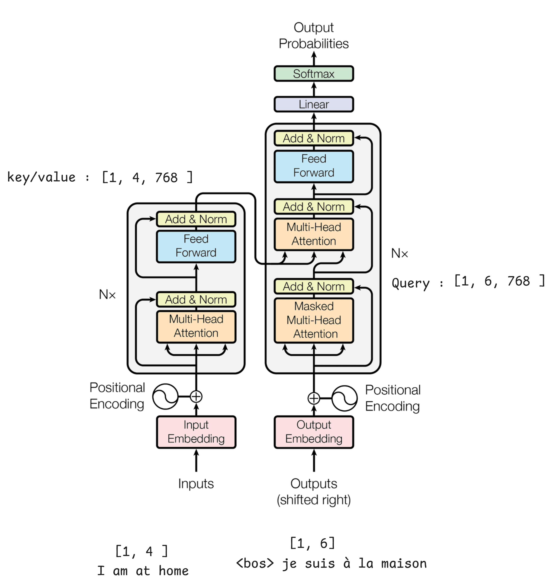

# Тренажер архитектуры трансформера

Интерактивный тренажер для изучения архитектуры трансформера (Transformer) с использованием Pygame. Этот проект позволяет визуально собрать и понять структуру энкодера и декодера трансформера.

## Описание

Тренажер представляет собой интерактивное приложение, где пользователь может:
- Собрать энкодер трансформера из базовых компонентов
- Собрать декодер трансформера
- Соединить энкодер и декодер
- Проверить правильность сборки

## Компоненты трансформера
Вспомним архитеткуру, ее и предстоить собрать самому:


## Как использовать

1. Запустите приложение
2. Перетащите компоненты из меню слева на рабочую область
3. Соедините компоненты, наведя на них курсор и выбрав точки соединения
4. Нажмите кнопку "Проверить" для проверки правильности сборки
5. После успешной сборки энкодера, соберите декодер
6. Соедините последний блок энкодера с Multi-Head Attention декодера

## Демонстрация


## Требования

- Python 3.x
- Pygame

## Установка

1. Клонируйте репозиторий:
```bash
git clone https://github.com/your-username/transformer-trainer.git
```

2. Установите зависимости:
```bash
pip install -r requirements.txt
```

3. Запустите приложение:
```bash
python transformer_game.py
```

## Особенности

- Визуальное представление архитектуры трансформера
- Интерактивная сборка компонентов
- Проверка правильности соединений
- Подсказки при ошибках
- Возможность начать заново с помощью корзины

## Структура проекта

```
transformer-trainer/
├── transformer_game.py
├── static/
│   └── trash.png
├── requirements.txt
└── README.md
```

## Вклад в проект

Если вы хотите внести свой вклад в проект:
1. Форкните репозиторий
2. Создайте ветку для ваших изменений
3. Внесите изменения
4. Создайте pull request

## Лицензия

MIT License

## Автор

[Быков Егор]
